\pagebreak

# 1 Problem Statement
create and deploy a scientific calculator with the following operations.
\
1. Square root - $\sqrt{x}$
\
2. Factorial - $x!$
\
3. Sign - $\sin({x})$
\
4. Cos - $\cos({x})$
\
5. Tan - $\tan({x})$
\
6. Power - $x^a$
 \
8. Logarithmic - $\log({x})$
\
9.  Exponential - $\exp^x$

# 2 Tools Used

* **Programming Language**: `Javascript`
  *  **Node** -`Node.js` is an open-source, cross-platform JavaScript runtime environment and library for running web applications outside the client's browser.
  *  **React** - `React` s a free and open-source front-end JavaScript library for building user interfaces based on components.React can be used as a base in the development of single-page, mobile, or server-rendered applications with frameworks like Next.js.
  *  **Jest** -`Jest` is a JavaScript testing framework designed to ensure correctness of any JavaScript codebase. It allows you to write tests with an approachable, familiar and feature-rich API that gives you results quickly. Jest is well-documented, requires little configuration and can be extended to match your requirements.
* **Package Manager**
  *  **npm** - `npm` stands for Node Package Manager. It's a library and registry for JavaScript software packages. npm also has command-line tools to help you install the different packages and manage their dependencies.
* **Source Code Managament**:

  * **Git** - `Git`  is a distributed version control system that tracks changes in any set of computer files, usually used for coordinating work among programmers collaboratively developing source code during software development. Its goals include speed, data integrity, and support for distributed, non-linear workflows.


  * **GitHub** - `GitHub` s an Internet hosting service for software development and version control using Git. It provides the distributed version control of Git plus access control, bug tracking, software feature requests, task management, continuous integration, and wikis for every project.
* **Continuos Integration/Continuos Deployment**:
  * **GitHub Actions** - `GitHub Actions` makes it easy to automate all your software workflows, now with world-class CI/CD. Build, test, and deploy your code right from GitHub. Make code reviews, branch management, and issue triaging work the way you want.

* **Containerization**:
  *  **Docker** - `Docker` is a software platform that allows you to build, test, and deploy applications quickly. Docker packages software into standardized units called containers that have everything the software needs to run including libraries, system tools, code, and runtime.
  *  **Docker Hub** - `Docker Hub` is a registry service on the cloud that allows you to download Docker images that are built by other communities. You can also upload your own Docker built images to Docker hub


* **Monitoring Tool**: `ELK stack`

  * **Elastic Search** - `ElasticSearch` is a distributed, open-source search and analytics engine built on Apache Lucene and developed in Java. It started as a scalable version of the Lucene open-source search framework then added the ability to horizontally scale Lucene indices. Elasticsearch allows you to store, search, and analyze huge volumes of data quickly and in near real-time and give back answers in milliseconds. It’s able to achieve fast search responses because instead of searching the text directly, it searches an index.
  * **Logstash** - `Logstash` is used to aggregate and process data and send it to Elasticsearch. It is an open-source, server-side data processing pipeline that ingests data from a multitude of sources simultaneously, transforms it, and then sends it to collect. It also transforms and prepares data regardless of format by identifying named fields to build structure, and transform them to converge on a common format.
  * **Kibana** - `Kibana` provides visualization capabilities on top of the content indexed on an Elasticsearch cluster. Users can create bar, line and scatter plots, or pie charts and maps on top of large volumes of data.Kibana also provides a presentation tool, referred to as Canvas, that allows users to create slide decks that pull live data directly from Elasticsearch.
  
\pagebreak

# 3 Development Setup:
## 3.1 setup development enironment:
* Update packages
  ```bash
   $ sudo apt-get update
  ```
* Install npm
  ```bash
   #install npm
   $ sudo apt install npm
  
   #verify npm version
   $ npm -v
  ```
* Install Node
  ```bash
   #Install node 
   $ sudo apt install node
  
   #verify node version
   $ node -v
  ```
* Install create-react-app
  ```bash
   #Install create-react-app locally
   $ npm install create-react-app
   
   #Install create-react-app Globally
   $ npm install -g create-react-app
  
  ```
* Create React App
  ```bash
   
   $ create-react-app devops-calculator

   #Run basic script 
   $ cd devops-calculator
   $ npm start
  
  ```
## 3.2 Source Code Management Setup:
    $~~~~~~$Source code management (SCM) is used to track  modifications to a source code repository. SCM  tracks a running history of changes to a code base and helps resolve conflicts when merging updates from multiple contributors. SCM is also synonymous with Version control. 

    As software projects grow in lines of code and contributor head count, the costs of communication overhead and management complexity also grow. SCM is a critical tool to alleviate the organizational strain of growing development costs.This is accomplished with `GitHub`.
    \break
     * Create a github account and add a repository as shown below.
  \break

    

    Follow the steps mentioned to initialize a local repository on your machine and push your code. Run
    these in the working directory of your app created using create-react-app.
   
  

```bash
   # Initialize my react app project as repository
   $ git init

   # link local repo to remote repository
   $ git remote add origin <GitHUB Url>.git

   #Add Untracked files to staging area
   $ git add .
   
   #commit local changes to local repository
   $ git commit -m "commit changes"

   #Push your project to remote repository
   $ git push -u origin master
   #Use GitHub Pesonal Access Token as password to authenticate
  ```
  
  
* After commit and push to remote repository the github remote repository should look something like this.

  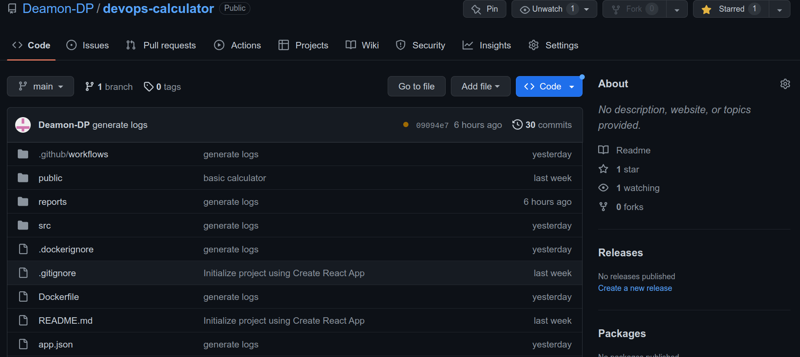


## 3.3 Docker and Docker Hub:

 Docker is a set of platform as a service (PaaS) products that use OS-level virtualization
 to deliver software in packages called `containers`.Basically it is a utility to pack, ship and run any application as a lightweight container.Using Docker, you can quickly deploy and scale applications into any environment and know your code will run.

* Create a DockerHub account
* Create a public Repository in docker hub

  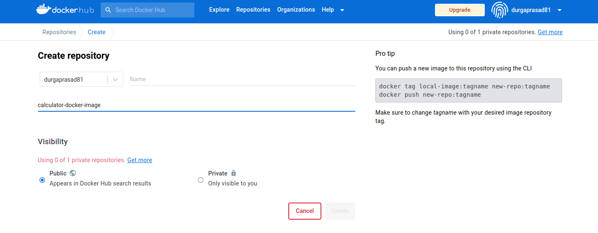

## 3.4 CI/CD Pipeline Setup:

CI/CD falls under DevOps (the joining of development and operations teams) and combines the practices of continuous integration and continuous delivery. CI/CD automates much or all of the manual human intervention traditionally needed to get new code from a commit into production, encompassing the build, test (including integration tests, unit tests, and regression tests), and deploy phases, as well as infrastructure provisioning.
 
 A purpose-built CI/CD platform can maximize development time by improving an organization’s productivity, increasing efficiency, and streamlining workflows through built-in automation, testing, and collaboration. As applications grow larger, the features of CI/CD can help decrease development complexity.

In your working directory, create a pipeline.yml file with the following directory structure to get started with automating workflows using GitHub Actions.

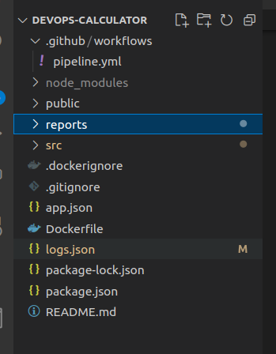{width=50% height=50%}

  ```yml
     

      name: pipeline

      on:

        workflow_dispatch:
        
        push:
          branches:
            - main
        pull_request:
          branches:
            - main
  ```


* To help you understand how YAML syntax is used to create a workflow file, this section explains each line of the introduction's example:

  * **name: pipeline:** optional - The name of the workflow as it will appear in the "Actions" tab of the GitHub repository.
  
  * **on: workflow_dispatch:** This allows you to manually trigger a workflow run through the GitHub web interface. It enables you to run a specific workflow on-demand rather than having it triggered by a specific event.
  
  * **push:branches:- main :** Specifies the trigger for this workflow. This example uses the push event, so a workflow run is triggered every time someone pushes a change to the main repository or merges a pull request. This is triggered by a push to main branch.


### 3.4.1 Build and Test:
  * **Build:**  
  Build project is typically compiled, optimized, and bundled into a single file or a set of files that can be easily deployed to a server or hosting environment. The build process can involve various steps such as transpiling TypeScript or ES6+ code into ES5 JavaScript, minifying and optimizing the code, and generating a package that includes all the project dependencies.
  ```yml
   build:
    runs-on: ubuntu-latest
    strategy:
      matrix:
        node-version: [18.x]
    steps:
      - name: Checkout code
        uses: actions/checkout@v2
      - name: Set up Node.js
        uses: actions/setup-node@v1
        with:
          node-version: ${{ matrix.node-version }}
      - name: npm setup
        run: npm ci
      - name: Build
        run: npm run build

  ```
  * **Syntax**:
  
    * **runs-on: ubuntu-latest** Configures the job to run on the latest version of an Ubuntu Linux runner. This means that the job will execute on a fresh virtual machine hosted by GitHub
    * **uses: actions/checkout@v2** The uses keyword specifies that this step will run v2 of the actions/checkout action. This is an action that checks out your repository onto the runner, allowing you to run scripts or other actions against your code 
    * **uses: actions/setup-node@v1** This step uses the actions/setup-node@v1 action to install the specified version of the Node.js. This puts both the node and npm commands in your PATH
    * **run: npm ci** The npm clean-install command (or npm ci for short) is an in-place replacement for npm install with two major differences: It does a clean install: if the node_modules folder exists, npm deletes it and installs a fresh one. 
    * **run** The run keyword tells the job to execute a command on the runner.

  * **Testing:**
  Testing stage involves testing the software to ensure it meets the specified requirements and is ready for deployment. This includes unit testing, integration testing, performance testing, and acceptance testing.
  
  The tests are typically written using a testing framework, such as Jest or Mocha, and can be run using `npm test`.

```yml
button-test:
    needs: build
    runs-on: ubuntu-latest
    strategy:
      matrix:
        node-version: [18.x]
    steps:
      - name: Checkout code
        uses: actions/checkout@v2
      - name: Set up Node.js
        uses: actions/setup-node@v1
        with:
          node-version: ${{ matrix.node-version }}
      - name: npm setup
        run: npm ci
      - name: button Test
        run: npm test devops-calculator/src/Buttons.test.js
```

  * npm test devops-calculator/src/Buttons.test.js this command will test all the buttons in calculator app.

```yml
  functional-test:
    needs: build
    runs-on: ubuntu-latest
    strategy:
      matrix:
        node-version: [18.x]
    steps:
      - name: Checkout code
        uses: actions/checkout@v2
      - name: Set up Node.js
        uses: actions/setup-node@v1
        with:
          node-version: ${{ matrix.node-version }}
      - name: npm setup
        run: npm ci
      - name: functional  Test
        run: npm test devops-calculator/src/App.test.js
```
  *  npm test devops-calculator/src/App.test.js this command will test all the functionalities in calculator app.

### 3.4.2 Containerize and Publish to DockerHub:

A `Docker container` is a lightweight, standalone executable package that contains all the software and dependencies required to run an application. It is a virtualized environment that provides an isolated space for an application to run on any operating system or infrastructure without affecting the host system.

Docker containers are built from `Docker images`, which are pre-configured templates that contain all the necessary components, including the application code, libraries, and dependencies. These images can be easily distributed and shared, making it easy to deploy applications across multiple environments.


\break

```yml
build-push-docker-Image:
    needs: [button-test,functional-test]
    runs-on: ubuntu-latest
    steps:
      - name: Checkout code
        uses: actions/checkout@v2

      - name: Build Docker image
      run: docker build -t <docker repo>/<docker image>:tag .

      - name: Log in to Docker registry
        uses: docker/login-action@v1
        with:
          registry: docker.io
          username: ${{ secrets.DOCKER_USERNAME }}
          password: ${{ secrets.DOCKER_PASSWORD }}

      - name: Push Docker image
        run: docker push <docker repo>/<docker image>:tag
```
* **Syntax**
  
  * **needs: [button-test,functional-test]** Use jobs.<job_id>.needs to identify any jobs that must complete successfully before this job will run. It can be a string or array of strings. If a job fails or is skipped, all jobs that need it are skipped unless the jobs use a conditional expression that causes the job to continue.
  * **docker push durgaprasad81/calculator-docker-image:latest** : This command will push the docker image to remote docker repo  durgaprasad81/calculator-docker-image with tag latest
  * **uses: docker/login-action@v1** : To authenticate against Docker Hub it's strongly recommended to create a personal access token as an alternative to your password.

The Docker User name and Password can be saved as shown below 

* **Settings under your repository → Secrets and Variables → Actions → New Repository Secret**

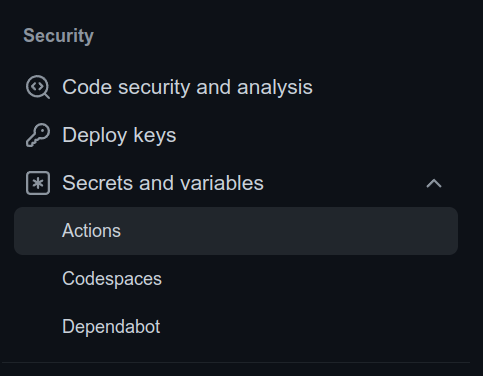{width=30% height=50%}
  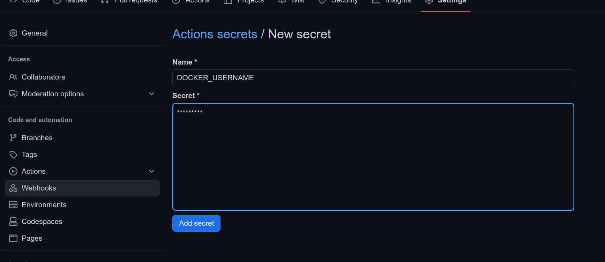{width=70% height=50%}

### 5.4.3 Deployment:

 It is a software development approach that automates the software build, testing, and deployment processes, enabling developers to release code changes more frequently and reliably.

* Deployment stage pulls the docker image from docker hub and starts a new container on the local host.For github to push jobs onto a local machine we have to install and configure what is called a self-hosted runner on our local machine.
* **Self Hosted Runner:**
\
  A self-hosted runner is a machine that can be used to run GitHub Actions workflows in your own environment, such as your own data center or cloud infrastructure.
\
  With a self-hosted runner, you have more control over the environment in which your workflows are executed. This can be useful if you need to run workflows on machines that have specific configurations or requirements that are not available in GitHub's hosted runners

#### Adding a self-hosted runner to a repository


  You can add self-hosted runners to a single repository. To add a self-hosted runner to a user repository, you must be the repository owner.
  
  * **Settings under your repository → Actions → Runners → New SelfHosted runner**

  * Now follow the steps mentioned in new self hosted runners page on your local host.

  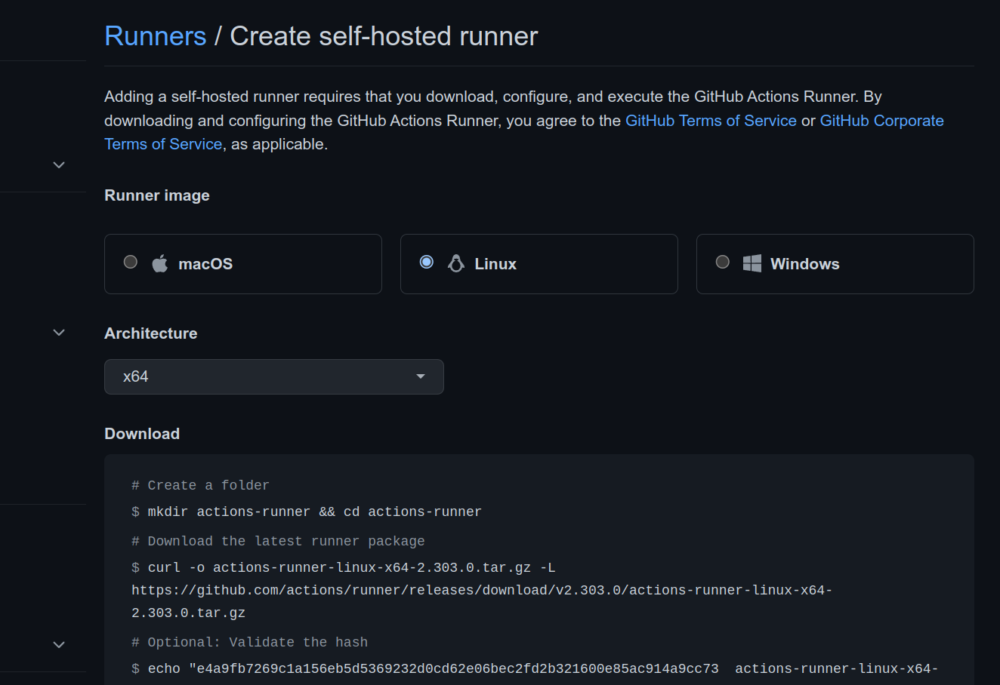{width=100% height=100%}

\pagebreak

#### Deploy stage:

\

  ```yml
  deploy:
      needs: build-push-docker-Image
      runs-on: self-hosted
    steps:
        - name: Pull Docker image
          run: docker pull <docker repo>/<docker-image>:<tag>
        - name: Stop running calculator-container
          run: docker stop calculator-container || true
        - name: remove container named calculator-container
          run : docker rm calculator-container || true
        - name: Start new container
          run: docker run --name calculator-container -d -p 3000:3000 
          -p 5000:5000 <docker repo>/<docker image>:<tag>
        - name: Sleep for 5 seconds
          uses: jakejarvis/wait-action@master
          with:
            time: '5s'
        - name: open the browser
          run: open "http://172.17.0.2:3000/"

  ```

  * This job pulls the docker image from docker hub.
  * Stops and removes calculator-container if exists.
  * starts a new container with name calculator-container and opens 3000 port
  * waits for 5 seconds.
  * opens the browser with url `http://172.17.0.2:3000/`

### 3.4.4 Pipeline

  * Pushing new changes to master branch will trigger the pipeline that we have setup `Build and {ButtonTest , FunctionalTest} → Publish → Deploy`

  we can iew this under Actions tab.

  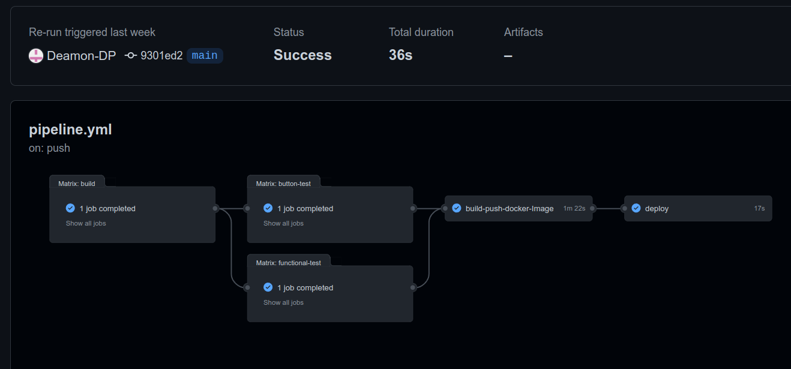

  * Click on a job for a detailed view.
  
  * **Build**
\

      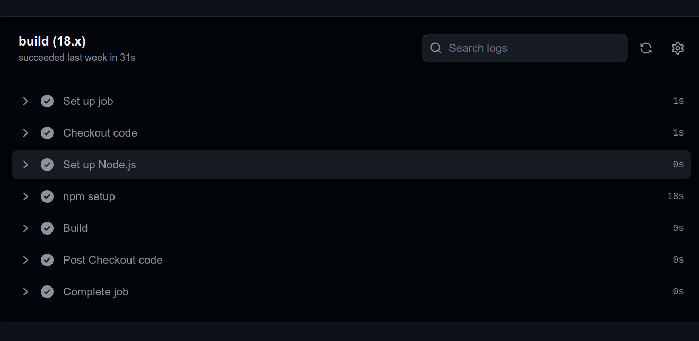{width=70%}
\
  * **Testing**
\
      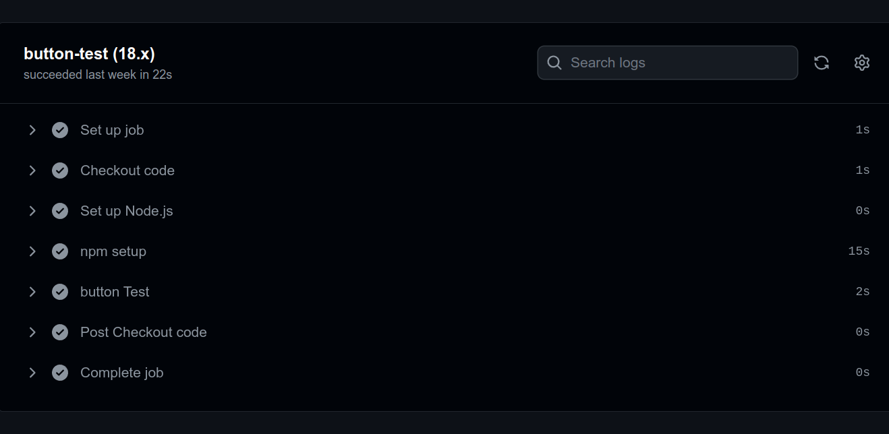{width=50%}
        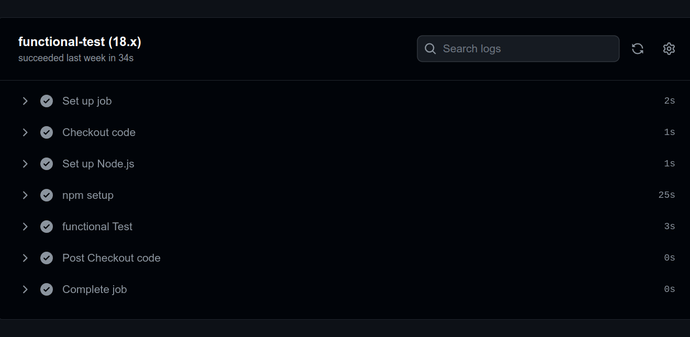{width=50%}
\
  * **Publishing**
\
      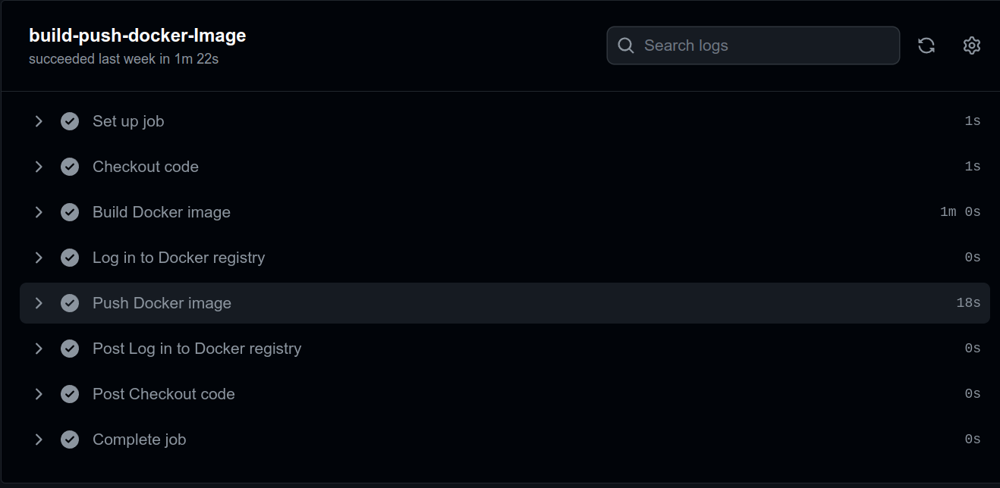{width=70%}
\
  * **Deploying**
\
      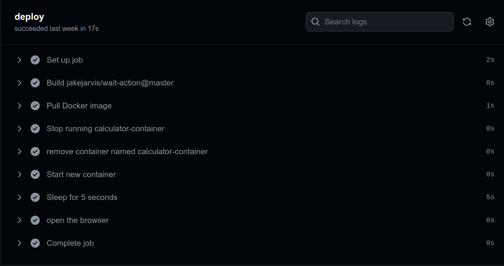{width=70%}
