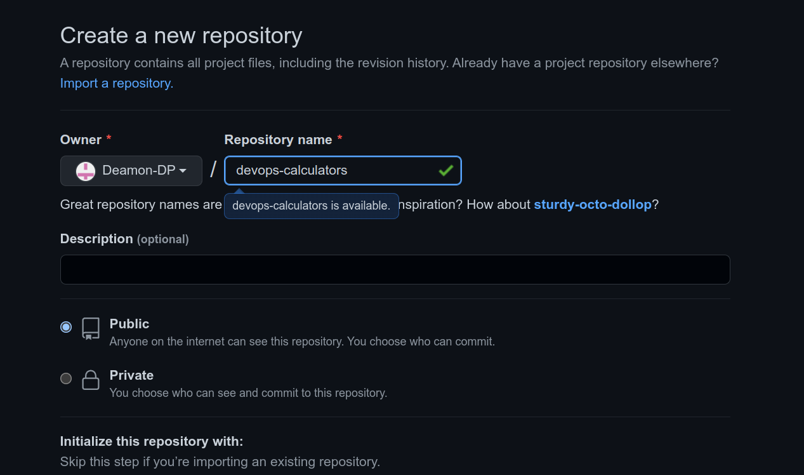

\pagebreak

# 1 Problem Statement
create and deploy a scientific calculator with the following operations.
\
1. Square root - $\sqrt{x}$
\
2. Factorial - $x!$
\
3. Sign - $\sin({x})$
\
4. Cos - $\cos({x})$
\
5. Tan - $\tan({x})$
\
6. Power - $x^a$
 \
8. Logarithmic - $\log({x})$
\
9.  Exponential - $\exp^x$

# 2 Tools Used

* **Programming Language**: `Javascript`
  *  **Node** -`Node.js` is an open-source, cross-platform JavaScript runtime environment and library for running web applications outside the client's browser.
  *  **React** - `React` s a free and open-source front-end JavaScript library for building user interfaces based on components.React can be used as a base in the development of single-page, mobile, or server-rendered applications with frameworks like Next.js.
  *  **Jest** -`Jest` is a JavaScript testing framework designed to ensure correctness of any JavaScript codebase. It allows you to write tests with an approachable, familiar and feature-rich API that gives you results quickly. Jest is well-documented, requires little configuration and can be extended to match your requirements.
* **Package Manager**
  *  **npm** - `npm` stands for Node Package Manager. It's a library and registry for JavaScript software packages. npm also has command-line tools to help you install the different packages and manage their dependencies.
* **Source Code Managament**:

  * **Git** - `Git`  is a distributed version control system that tracks changes in any set of computer files, usually used for coordinating work among programmers collaboratively developing source code during software development. Its goals include speed, data integrity, and support for distributed, non-linear workflows.


  * **GitHub** - `GitHub` s an Internet hosting service for software development and version control using Git. It provides the distributed version control of Git plus access control, bug tracking, software feature requests, task management, continuous integration, and wikis for every project.
* **Continuos Integration/Continuos Deployment**:
  * **GitHub Actions** - `GitHub Actions` makes it easy to automate all your software workflows, now with world-class CI/CD. Build, test, and deploy your code right from GitHub. Make code reviews, branch management, and issue triaging work the way you want.

* **Containerization**:
  *  **Docker** - `Docker` is a software platform that allows you to build, test, and deploy applications quickly. Docker packages software into standardized units called containers that have everything the software needs to run including libraries, system tools, code, and runtime.
  *  **Docker Hub** - `Docker Hub` is a registry service on the cloud that allows you to download Docker images that are built by other communities. You can also upload your own Docker built images to Docker hub


* **Monitoring Tool**: `ELK stack`

  * **Elastic Search** - `ElasticSearch` is a distributed, open-source search and analytics engine built on Apache Lucene and developed in Java. It started as a scalable version of the Lucene open-source search framework then added the ability to horizontally scale Lucene indices. Elasticsearch allows you to store, search, and analyze huge volumes of data quickly and in near real-time and give back answers in milliseconds. It’s able to achieve fast search responses because instead of searching the text directly, it searches an index.
  * **Logstash** - `Logstash` is used to aggregate and process data and send it to Elasticsearch. It is an open-source, server-side data processing pipeline that ingests data from a multitude of sources simultaneously, transforms it, and then sends it to collect. It also transforms and prepares data regardless of format by identifying named fields to build structure, and transform them to converge on a common format.
  * **Kibana** - `Kibana` provides visualization capabilities on top of the content indexed on an Elasticsearch cluster. Users can create bar, line and scatter plots, or pie charts and maps on top of large volumes of data.Kibana also provides a presentation tool, referred to as Canvas, that allows users to create slide decks that pull live data directly from Elasticsearch.
  
\pagebreak

# 3 Development Setup:
## 3.1 setup development enironment:
* Update packages
  ```bash
   $ sudo apt-get update
  ```
* Install npm
  ```bash
   #install npm
   $ sudo apt install npm
  
   #verify npm version
   $ npm -v
  ```
* Install Node
  ```bash
   #Install node 
   $ sudo apt install node
  
   #verify node version
   $ node -v
  ```
* Install create-react-app
  ```bash
   #Install create-react-app locally
   $ npm install create-react-app
   
   #Install create-react-app Globally
   $ npm install -g create-react-app
  
  ```
* Create React App
  ```bash
   
   $ create-react-app devops-calculator

   #Run basic script 
   $ cd devops-calculator
   $ npm start
  
  ```
## 3.2 Source Code Management Setup:
    $~~~~~~$Source code management (SCM) is used to track  modifications to a source code repository. SCM  tracks a running history of changes to a code base and helps resolve conflicts when merging updates from multiple contributors. SCM is also synonymous with Version control. 

    As software projects grow in lines of code and contributor head count, the costs of communication overhead and management complexity also grow. SCM is a critical tool to alleviate the organizational strain of growing development costs.This is accomplished with `GitHub`.
    \break
     * Create a github account and add a repository as shown below.
  \break

    

    Follow the steps mentioned to initialize a local repository on your machine and push your code. Run
    these in the working directory of your app created using create-react-app.
   
  

```bash
   
   $ git remote add origin https://github.com/Deamon/devops-calculator.git

   #Add a master branch 
   $ git branch -M master
   #Push your code to remote repository
   $ git push -u origin master
   #Use GitHub PAT(Pesonal Access Token) as password to authenticate
  ```

  ## Docker and Docker Hub:
